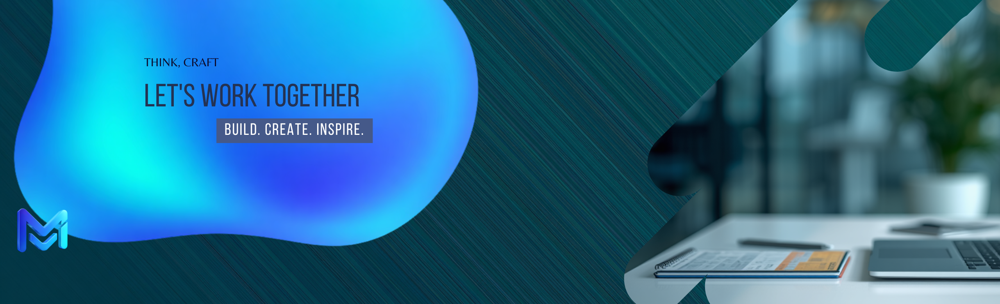

<p align="center">
  
</p>

<h1 align="center">Hi 👋, I'm Muhammad Hussnain</h1>

<h3 align="center">
Full Stack Web Developer • Open Source Enthusiast • Lifelong Learner
</h3>

<p align="center">
I enjoy building modern web applications, automating workflows, exploring AI, understanding how technology works behind the scenes, and continuously learning new skills.
</p>

<p align="center">
  
  
  
</p>

---

# 🚀 About Me

```ts
const MuhammadHussnain = {
  role: "Full Stack Developer",

  currentlyLearning: [
    "Artificial Intelligence",
    "System Design",
    "Operating Systems",
    "Cyber Security",
    "Networking",
    "Cloud Computing",
    "Reverse Engineering",
    "How Technologies Work",
  ],

  interests: [
    "Web Development",
    "Automation",
    "Open Source",
    "Developer Tools",
    "Roblox Development",
  ],

  motto: "Keep building. Keep learning. Keep exploring.",
  website: "https://mise-sys.vercel.app/",
  email: "misesysofficial@gmail.com",
};
```

---

# 💻 Tech Stack

## 🌐 Frontend

<p style="display:flex; justify-content : center; gap:20px;">


</p>

---

## ⚙ Backend & Database

<p style="display:flex; justify-content : center; gap:20px;">


</p>

---

## 💻 Programming Languages

<p style="display:flex; justify-content : center; gap:20px;">


</p>

---

## 🛠 Tools

<p style="display:flex; justify-content : center; gap:20px;">


</p>

---

# 🎯 Areas of Interest

- 🌐 Full Stack Development
- ⚛️ React & Next.js
- 🖥️ Operating Systems
- 🌍 Networking
- 📦 Open Source

---

# 📊 GitHub Statistics

<p align="center">

</p>

---

# 📈 Contribution Graph

<p align="center">

</p>

---

# ⌨️ Statistics

<!--START_SECTION:waka-->

```txt
From: 19 January 2026 - To: 05 August 2026

Total Time: 33 hrs 43 mins

Python               18 hrs 13 mins        █████████████▒░░░░░░░░░░░   53.41 %
HTML                 5 hrs 38 mins         ████░░░░░░░░░░░░░░░░░░░░░   16.53 %
Rust                 3 hrs                 ██▒░░░░░░░░░░░░░░░░░░░░░░   08.82 %
JSON                 2 hrs 9 mins          █▓░░░░░░░░░░░░░░░░░░░░░░░   06.33 %
TypeScript           1 hr 49 mins          █▒░░░░░░░░░░░░░░░░░░░░░░░   05.35 %
Markdown             59 mins               ▓░░░░░░░░░░░░░░░░░░░░░░░░   02.88 %
C                    42 mins               ▓░░░░░░░░░░░░░░░░░░░░░░░░   02.06 %
JavaScript           35 mins               ▒░░░░░░░░░░░░░░░░░░░░░░░░   01.74 %
Other                23 mins               ▒░░░░░░░░░░░░░░░░░░░░░░░░   01.16 %
```

<!--END_SECTION:waka-->

---

# 📅 Weekly Development Breakdown

<!--START_SECTION:waka_simple-->
<!--END_SECTION:waka_simple-->

---


# ⚡ Currently Learning

I'm currently focused on understanding **how things actually work** rather than only learning frameworks.

### Topics

- 🧠 Artificial Intelligence
- 🤖 Machine Learning
- ⚙️ System Design
- 🖥️ Operating Systems
- 🌍 Computer Networks
- 🔐 Cyber Security
- ☁️ Cloud Computing
- 🧩 Reverse Engineering
- 📦 DevOps
- 🐧 Linux Internals
- ⚡ Performance Optimization

---

# 💼 Experience

### 🌐 Web Development

✔ Next.js  
✔ React  
✔ JavaScript  
✔ TypeScript  
✔ HTML5  
✔ CSS3

---

### 🗄 Databases

✔ MongoDB  
✔ SQL  
✔ NoSQL

---

### 💻 Programming

✔ Python  
✔ C#  
✔ C  
✔ Lua

---

### ⚙ Development Tools

✔ Git  
✔ GitHub  
✔ GitHub Actions  
✔ VS Code  
✔ Linux

---

# 🚀 What I Love Building

- 🌐 Modern Web Applications
- ⚡ Developer Tools
- 📦 Open Source Projects
- 🛠 Automation Scripts
- 🔐 Security Tools
- 📊 Dashboards

---

# 📌 Current Goals

- 🚀 Build impactful open-source projects
- 📚 Learn deeply instead of quickly
- 🤝 Contribute to the developer community
- 🧠 Understand low-level computer systems
- 🌍 Create software used by thousands of people

---

# 📊 GitHub Metrics


---

# 💡 Philosophy

```text
Learn deeply.
Build consistently.
Automate repetitive work.
Share knowledge.
Stay curious.
Never stop improving.
```

---

# 🏅 Achievements

- 🚀 Building modern Full Stack applications with **Next.js** & **React**
- 🌱 Lifelong learner focused on understanding **how technology works**
- 🤝 Open Source contributor
- ⚡ Passionate about automation & developer experience
- 🧠 Always experimenting with AI and new technologies

---

# 🌍 Connect With Me

<p style="display: flex; gap: 10px; justify-content: center;">
  <a href="https://github.com/DevMuhammadHussnain">
    
  </a>
  <a href="https://mise-sys.vercel.app/" target="_blank">
    
  </a>
  <a href="mailto:misesysofficial@gmail.com">
    
  </a>
</p>

---

# 📚 Favorite Technologies

<p align="center" style="display:flex; justify-content : space-between;">

</p>

---

# 💭 Quote

> _"The best way to understand technology is not just to use it—but to discover how it works beneath the surface."_

---

# 👀 Profile Visitors

<p align="center">

</p>

---

# ⭐ Thanks for visiting!

<p align="center">
If you like my work, consider giving a ⭐ to my repositories.

Happy Coding! 🚀

</p>
